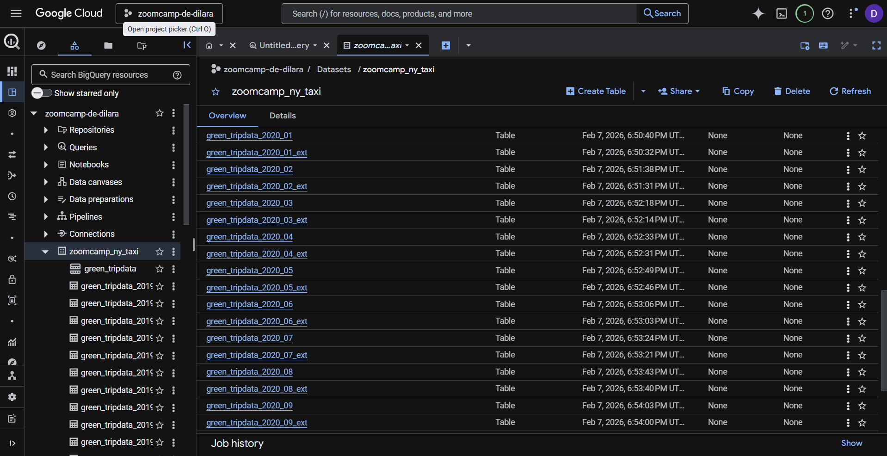

# Module 2 Homework – Workflow Orchestration with Kestra & GCP
Data Engineering Zoomcamp by DataTalksClub

This repository contains my solutions for **Module 2 (Workflow Orchestration with Kestra & GCP)** of the Data Engineering Zoomcamp.  

Focus of this module:  
- Orchestrating workflows with **Kestra**  
- Downloading, processing, and uploading **NYC Taxi Data** (Yellow & Green)  
- Loading data into **Google Cloud Storage (GCS)** and **BigQuery**  
- Using **Backfill** and **Manual Execution** for monthly datasets

---

## Pipeline Overview

This project implements an end-to-end data pipeline orchestrated with **Kestra** and deployed on **Google Cloud Platform**.

1. **Workflow Orchestration (Kestra)**  
   Kestra is used as the main orchestrator to manage executions, scheduling, backfills, and manual runs.  
   All ingestion steps are defined as Kestra flows and executed through the Kestra UI.

2. **Data Ingestion**  
   Monthly NYC Yellow and Green Taxi data (`.csv.gz`) is downloaded from the public DataTalksClub GitHub repository and extracted during execution.

3. **Cloud Storage (GCS)**  
   The extracted CSV files are uploaded to Google Cloud Storage, which serves as the landing zone for raw data.

4. **Data Loading & Analytics (BigQuery)**  
   Kestra triggers BigQuery jobs to load data from GCS into partitioned BigQuery tables, which are then queried using SQL to answer homework questions.

In summary, **Kestra handles orchestration**, **GCS handles storage**, and **BigQuery handles analytics**.

### GCP Dataset Overview

The dataset uploaded to **BigQuery** in the `zoomcamp_ny_taxi` dataset can be seen below:



## Data Used  

- **Yellow Taxi Data:** 2019, 2020, 2021 (Jan–Jul)  
- **Green Taxi Data:** 2019, 2020, 2021 (Jan–Jul)  
- Source: Source: [DataTalksClub NYC TLC Data Releases](https://github.com/DataTalksClub/nyc-tlc-data/releases)
- Data uploaded to **GCS** and merged into **BigQuery partitioned tables**:  
  - `zoomcamp_ny_taxi.yellow_tripdata`  
  - `zoomcamp_ny_taxi.green_tripdata`

---

### Question 1. Within the execution for Yellow Taxi data for the year 2020 and month 12: what is the uncompressed file size (i.e. the output file `yellow_tripdata_2020-12.csv` of the extract task)?  
 
- 128.3 MiB  
- 134.5 MiB  
- 364.7 MiB  
- 692.6 MiB  

**Answer:** 134.5 MiB  

---

### Question 2. What is the rendered value of the variable `file` when the inputs `taxi=green`, `year=2020`, `month=04` during execution?  
  
- `{{inputs.taxi}}tripdata{{inputs.year}}-{{inputs.month}}.csv`  
- `green_tripdata_2020-04.csv`  
- `green_tripdata_04_2020.csv`  
- `green_tripdata_2020.csv`  

**Answer:** green_tripdata_2020-04.csv  

---

### Question 3. How many rows are there for the Yellow Taxi data for all CSV files in the year 2020?  
 
- 13,537,299  
- 24,648,499  
- 18,324,219  
- 29,430,127  

**Answer:** 24,648,499

Note: Minor row count differences may occur due to dataset versions and ingestion details.

📄 SQL file: `sql/q3_yellow_2020_count.sql`

### Question 4. How many rows are there for the **Green Taxi data** for **all CSV files in the year 2020**?

- 5,327,301  
- 936,199  
- 1,734,051  
- 1,342,034  

**Answer:** **1,734,051**

Note: Minor row count differences may occur due to dataset versions and ingestion details.

📄 SQL file: `sql/q4_green_2020_count.sql`

---

### Question 5. How many rows are there for the **Yellow Taxi data** for the **March 2021 CSV file**?

- 1,428,092  
- 706,911  
- 1,925,152  
- 2,561,031  

**Answer:** **1,925,152**

📄 SQL file: `sql/q5_yellow_2021_03_count.sql`

---

### Question 6. How would you configure the **timezone to New York** in a **Schedule trigger**?

- Add a timezone property set to `EST`  
- Add a timezone property set to `America/New_York`  
- Add a timezone property set to `UTC-5`  
- Add a location property set to `New_York`  

**Answer:**  
Add a timezone property set to **America/New_York** in the Schedule trigger configuration.

Example Schedule trigger:

```yaml
triggers:
  - id: monthly_schedule
    type: io.kestra.plugin.core.trigger.Schedule
    cron: "0 0 1 * *"
    timezone: America/New_York
